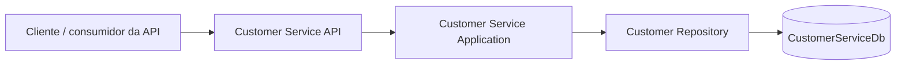

# Arquitetura

## Visão geral

O repositório implementa somente o Customer Service. O serviço mantém os dados cadastrais e o CPF, sem decidir crédito, limite ou cartão. Credit e Card são limites de contexto da plataforma, mas não fazem parte desta implementação.

## Responsabilidades e ownership

| Serviço | Responsabilidade | Estado neste repositório |
| --- | --- | --- |
| Customer Service | Cadastro, consulta, CPF e dados cadastrais | Implementado |
| Credit Service | Solicitações, análise e decisão de crédito | Fora do escopo; não implementado |
| Card Service | Emissão e ciclo de vida de cartões | Fora do escopo; não implementado |

Customer Service é o único dono de seus dados e de `CustomerServiceDb`. Outros serviços não devem consultar tabelas ou compartilhar entidades de domínio; futuras integrações devem usar contratos explícitos. Atualmente não há comunicação entre serviços.

## Camadas

- **Domain:** entidade `Customer` e value object `Cpf`; concentram validações e normalização cadastral.
- **Application:** comandos, consultas, handlers e `ICustomerRepository`; não depende do EF Core.
- **Infrastructure:** EF Core, SQL Server, migrations e implementação do repositório.
- **API:** contratos HTTP, Swagger, status codes e composição de dependências.

Domain não depende das camadas externas. A API converte erros conhecidos em `ProblemDetails`; erros inesperados passam pelo exception handler global e não expõem detalhes internos no corpo HTTP.

## Persistência e consistência

O banco SQL Server contém a tabela `Customers`. CPF é normalizado para 11 dígitos ASCII e armazenado sem pontuação. A aplicação consulta duplicidade para responder rapidamente; um índice único no banco é a garantia definitiva contra gravações concorrentes. A Infrastructure traduz violações de unicidade em conflito de CPF para a Application/API.

Migrations pertencem a `CustomerService.Infrastructure`. Não há chaves estrangeiras nem acesso a bancos de outros serviços.

## API e fluxo principal

1. `POST /api/customers` valida o contrato HTTP e encaminha um comando ao handler.
2. O domínio valida nome, CPF, e-mail e data de nascimento.
3. O handler consulta duplicidade e solicita a gravação ao repositório.
4. A API retorna `201`, `400` ou `409` conforme o resultado.
5. `GET /api/customers/{id}` retorna `200` ou `404`.
6. Exceções inesperadas resultam em `500` com `ProblemDetails` genérico.

Não são emitidos eventos nesta etapa. RabbitMQ, eventos de crédito/cartão, retry e DLQ ficam fora do escopo atual.

## Execução e validação

Consulte o [README](../README.md) para configuração por User Secrets, execução da API, migrations e comandos de build/teste. Os testes unitários e HTTP usam repositório em memória; a validação contra SQL Server exige uma instância configurada separadamente.

## Observabilidade e próximos passos

O tratamento HTTP registra exceções por meio do middleware ASP.NET Core, sem incluir detalhes no corpo de resposta. Não há métricas, health checks, autenticação ou correlation ID configurados. Avaliar essas necessidades antes de adicionar infraestrutura de observabilidade.